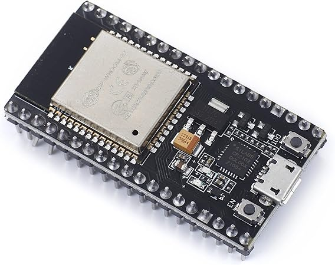
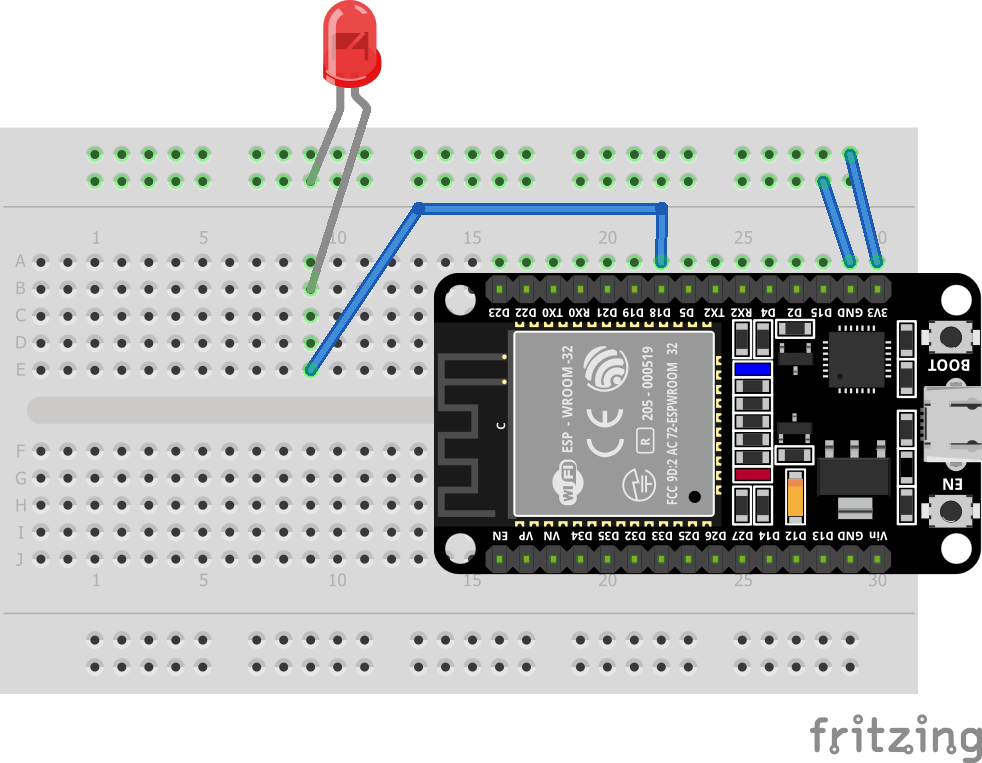
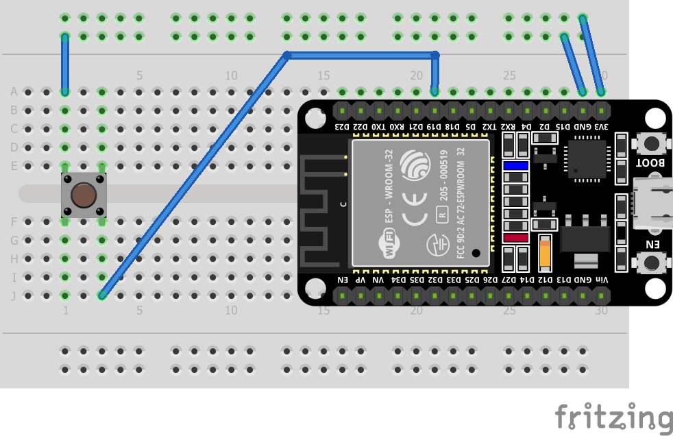
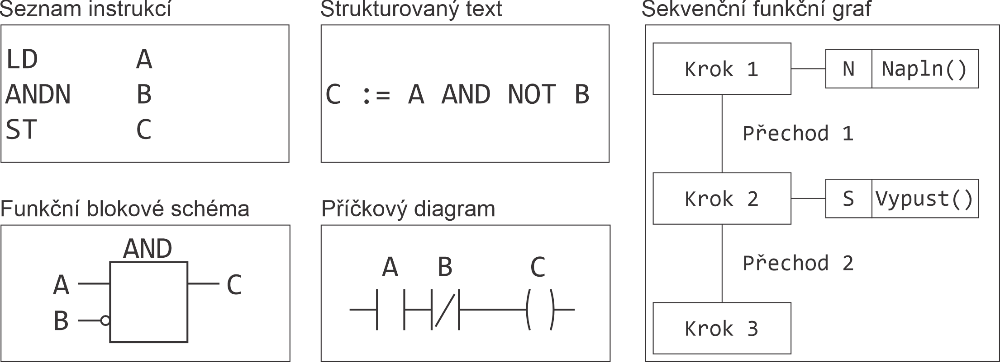

# IoT Workshop Wakan
## 24. března 2024

* Vojtěch beil
* vojtech@beil.cz

---

# IoT

* IoT = **I**nternet **o**f **T**hings
* Wikipedia: Internet věcí (anglicky Internet of Things, zkratka IoT) je v informatice označení pro síť fyzických zařízení, vozidel, domácích spotřebičů a dalších zařízení, která jsou vybavena elektronikou, softwarem, senzory, pohyblivými částmi a síťovou konektivitou, která umožňuje těmto zařízením se propojit a vyměňovat si data. Každé z těchto zařízení je jasně identifikovatelné díky implementovanému výpočetnímu systému, ale přesto je schopno pracovat samostatně v existující infrastruktuře internetu.

---

# Kontrolery



* Arduino (Uno, Micro, Mega, Leonardo, Lilypad, ...)
* ESP8266, ESP32, ...
* Raspberry Pi (Orange Pi, Banana Pi, ...)
* micro:bit
* Profesionální
    * Beckhoff TwinCAT
    * Siemens Simatic
    * ...

---

# Arduino IDE

* Původně pro programování Arduino desek.
* Nyní má podporu i pro další desky

```
C:\Git\IoT-Workshop-Wakan\
```

---

# Minimální kód

```C++
void setup() {
  // kod, ktery se provede pouze jednou pri startu
}

void loop() {
  // kod, ktery se provadi stale dokola
}
```

---

# Blinky




```C++
#define PIN 18                  // Budeme používat digiální pin D18

void setup() {                  // Inicializace zařízení, rozhranní
    pinMode(PIN, OUTPUT);       // Pin 18 bude sloužit jako výstup
}

void loop() {                   // Origramová smyčka
  digitalWrite(PIN, HIGH);      // Nastavení logické jedničky (zapnuto)
  delay(500);                   // Čekání 500 ms

  digitalWrite(PIN, LOW);       // Nastavení logické nuly (vypnuto)
  delay(500);                   // Čekání 500 ms
}
```

---

# ESP32

| Název     | Espressif Systems ESP32 |
| -         | -       |
| CPU       | Tensilica Xtensa single-/dual-core 32-bit LX6 mikroprocesor, 1-2 CPU 240 MHz |
| Paměť     | 520 KiB RAM, 448 KiB ROM  |
| Wi-fi     | 802.11 b/g/n |
| Bluetooth | v4.2 BR/EDR, BLE |
| I/O       | 34× GPIO, 12× 8bit DAC, 10× touch sensor, 4× SPI, 2× I2S, 2× I2C, 3× UART, CAN bus, PWM, ... |
| Šifrování | AES, SHA-2, RSA, eliptické křivky (ECC), generátor náhodných čísel (RNG) |

---

# Tlačítko




```C++
#define PIN 19

void setup() {
    Serial.begin(115200);
    pinMode(PIN, INPUT_PULLUP);
}

void loop() {
  int button = digitalRead(PIN);
  Serial.printf("Tlaciko = %d\n", button);
  delay(200);
}

```

---

# Programovací jazyky

* C/C++
* Assembler
* Lua
* MicroPython
* .NET Micro Framework
* IEC 61131-3



